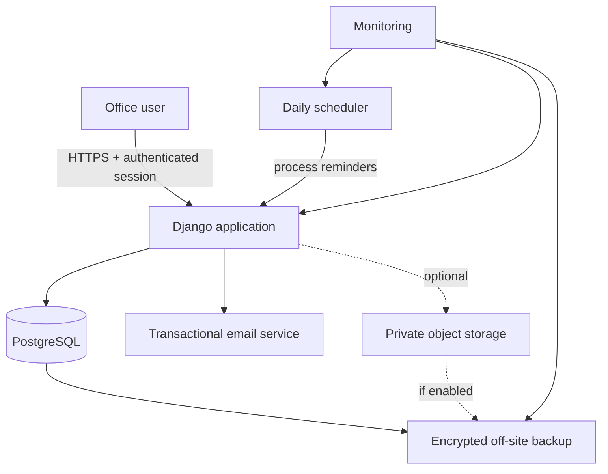
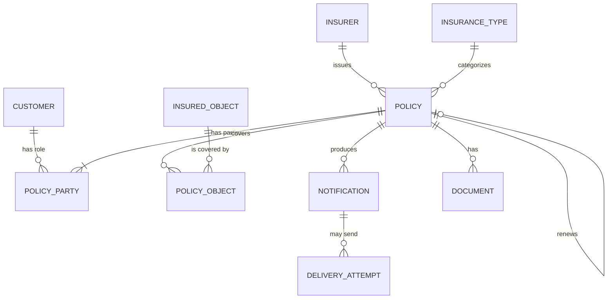

# Architecture

## 1. Document status

Status: **proposed baseline, pending repository audit**.

This document defines the target architecture of the insurance-policy
management application. It deliberately describes a small production system,
not a general insurance platform.

After the repository is provided and audited, this document must be updated
with:

- the actual code and directory structure;
- confirmed framework and dependency versions;
- implemented versus planned components;
- exact deployment model;
- accepted deviations recorded as ADRs.

## 2. Product context

The application is an internal tool for a small real-estate office, initially
used by one person. Its core responsibility is:

> Keep a trustworthy register of insurance policies and prevent policy
> expiration or renewal work from being missed.

The product is not initially:

- an insurer system;
- a customer portal;
- a policy-sales marketplace;
- a full CRM;
- an accounting system;
- a mobile application;
- an AI/OCR automation platform.

## 3. Architectural drivers

In priority order:

1. Correct expiration dates and reliable reminders.
2. Confidentiality and integrity of customer data.
3. Simple workflows for a non-technical user.
4. Preservation of policy and renewal history.
5. Recoverability after failure.
6. Low operating and maintenance complexity.
7. Ability to add a small number of users later.

The expected data volume is hundreds to several thousand records. The system is
not throughput-bound. Complexity should therefore be justified by correctness
or operations, not scale speculation.

## 4. Scope

### 4.1 MVP capabilities

- private login without public registration;
- customers: people and companies;
- insurers and insurance-type dictionaries;
- policies with coverage dates, status, premium, notes, and insurer;
- insured persons/organizations and insured objects;
- search and filtering;
- renewal without losing the previous policy;
- durable in-app notifications;
- internal email alerts;
- daily expiration processing;
- recording reminder outcomes;
- CSV/XLSX export;
- initial data import;
- essential audit history;
- production deployment with HTTPS, monitoring, and backups.

### 4.2 Optional after MVP

- private policy-document storage;
- custom follow-up dates;
- calendar view;
- two-factor authentication if not included before launch;
- additional users and finer permissions;
- richer operational reports.

### 4.3 Explicitly deferred

- automatic customer emails;
- SMS;
- customer self-service portal;
- OCR of policy documents;
- automated policy sales or payments;
- integrations with insurer APIs;
- commission accounting;
- native mobile applications;
- AI features;
- multi-tenant SaaS support.

## 5. System architecture

### 5.1 Style

The target is a **modular monolith**: one deployable application with explicit
internal domain modules and one relational database.

This style provides transactional consistency and simple deployment while
keeping module boundaries clear enough for later evolution.

### 5.2 Main technology choices

Target choices, subject to repository audit:

- application: Django;
- UI: Django templates with Bootstrap and optionally HTMX;
- production database: PostgreSQL;
- application server: production WSGI/ASGI server appropriate to the project;
- packaging: Docker;
- scheduling: platform scheduler or cron invoking a Django management command;
- email: transactional email provider or approved office SMTP relay;
- files: private EU-region object storage, only if document upload is enabled;
- hosting: managed EU-region application platform preferred, EU VPS acceptable;
- monitoring: uptime, exceptions, scheduled-job heartbeat, email failures,
  backup failures.

Exact vendors are deployment decisions and should be recorded separately.

### 5.3 Why not a separate frontend

The application is primarily authenticated forms, tables, filters, and
workflows. Server-rendered pages avoid a separate API/UI codebase and reduce:

- authentication complexity;
- duplicated validation;
- build and deployment steps;
- dependency surface;
- coordination cost between agents.

Small dynamic interactions may use HTMX. A full SPA requires evidence that the
server-rendered approach cannot meet a real workflow need.

### 5.4 Why no task queue initially

The initial asynchronous workload is one daily reminder pass and a small number
of emails. A scheduled command plus PostgreSQL state is sufficient.

Celery, Redis, or another queue may be introduced only when actual requirements
include significant concurrent work, bulk sending, OCR, or many integrations.

## 6. Logical modules

### `accounts`

Responsibilities:

- users;
- authentication;
- authorization and roles;
- account status;
- security events.

### `customers`

Responsibilities:

- people and companies;
- contact details;
- active/archived state;
- communication preferences if later required.

### `insurers`

Responsibilities:

- insurers;
- insurer contact information;
- insurance-type dictionaries;
- activation/deactivation of reference data.

### `policies`

Responsibilities:

- policy lifecycle;
- policy parties and their roles;
- insured objects;
- coverage dates;
- cancellation and archival;
- renewal chains;
- policy validation.

### `notifications`

Responsibilities:

- reminder rules;
- concrete in-app notifications;
- scheduling and deduplication;
- email attempts and retry state;
- user handling outcomes;
- scheduler heartbeat.

### `documents`

Optional responsibilities:

- policy attachment metadata;
- private storage integration;
- upload/download authorization;
- safe deletion/retention behavior.

### `audit`

Responsibilities:

- significant domain changes;
- actor, action, target, timestamp;
- security-safe change summaries.

## 7. Domain model

### 7.1 Core entities

| Entity | Purpose | Important fields |
|---|---|---|
| `User` | application account | email/login, role, active status |
| `Customer` | person or company | type, display name, contact data, archive status |
| `Insurer` | insurance company | canonical name, contact data, active status |
| `InsuranceType` | controlled policy category | name, active status |
| `Policy` | insurance contract | number, dates, status, premium, currency, insurer, previous policy |
| `PolicyParty` | customer's role in a policy | policy, customer, role |
| `InsuredObject` | insured person/property/vehicle/etc. | type, label, selected structured data |
| `PolicyObject` | policy-to-object relation | policy, insured object |
| `ReminderRule` | reusable reminder timing | offset, channel, active status |
| `Notification` | durable reminder occurrence | schedule, status, handling state |
| `DeliveryAttempt` | email attempt | recipient, attempt time, result, safe error |
| `Document` | optional attachment metadata | policy, key, type, size, checksum |
| `AuditEvent` | business/security history | actor, action, target, timestamp, summary |

### 7.2 Relationships

### 7.3 Customer and policy parties

A single `customer_id` on the policy is insufficient as a complete model.
The policyholder, insured party, and payer may differ, and multiple parties may
participate in one policy.

`PolicyParty` therefore represents a customer in one or more controlled roles,
for example:

- policyholder;
- insured;
- payer;
- beneficiary, only if the business requires it.

The UI should remain simple: by default it may assign the selected customer as
both policyholder and insured, with an advanced option to change roles.

### 7.4 Insured objects

Supported top-level types:

- property;
- vehicle;
- person;
- company/business;
- other.

MVP should keep only stable, necessary fields structured. Rare details belong
in a description until real use demonstrates a search, validation, or reporting
need. Avoid an unvalidated generic JSON field for core business invariants.

### 7.5 Policy status

Persisted statuses:

- `DRAFT`;
- `ACTIVE`;
- `EXPIRED`;
- `RENEWED`;
- `CANCELLED`.

“Expiring soon” is a derived state based on the active policy end date and a
configured horizon. It should not be a stored status that can become stale.

### 7.6 Policy invariants

- End date is not before start date.
- Renewal creates a new policy.
- The new policy may point to one previous policy.
- A policy cannot reference itself or create a renewal loop.
- A renewed/cancelled policy does not generate obsolete future reminders.
- Historical policies remain accessible.
- Money uses decimal values and an explicit currency.
- Business dates and execution timestamps remain distinct.

## 8. Reminder architecture

### 8.1 Default schedule

Initial configurable rules:

- 30 days before expiration;
- 14 days before expiration;
- 7 days before expiration;
- 1 day before expiration;
- on the expiration date;
- 1 day after expiration when still unhandled.

### 8.2 Durable state

A notification is a database record, not merely an email.

Suggested notification states:

- `SCHEDULED`;
- `READY`;
- `SENT` for channel delivery, if delivery state is kept on the notification;
- `FAILED` for exhausted delivery attempts;
- `READ`;
- `HANDLED`;
- `CANCELLED`.

Prefer separating business handling state from delivery-attempt state. An email
can succeed while the policy-renewal task remains unhandled.

### 8.3 Daily processing

The scheduler invokes one application command, conceptually
`process_reminders`, once per day, for example at 07:00 `Europe/Warsaw`.

The command:

1. records the start of a run;
2. selects eligible active policies;
3. creates missing notification records;
4. skips already-created occurrences;
5. queues or directly performs bounded email attempts;
6. records success and safe error details;
7. records successful run completion;
8. exposes failure to monitoring.

### 8.4 Idempotency

The database must enforce a unique key equivalent to:

`policy_id + reminder_rule_id + scheduled_for + channel`

The task may then use an atomic create/get pattern. Re-running the command must
not create duplicate notifications or emails.

An application-level `exists()` check alone is not enough because concurrent
runs can both observe no record before inserting.

### 8.5 Email delivery

MVP email recipients are internal office users.

Email content should contain only:

- timing, e.g. “policy expires in 14 days”;
- customer display name;
- policy type and number if required;
- expiration date;
- authenticated link to the record.

Do not attach policy files. Do not include sensitive details that are not needed
to identify the task.

Temporary delivery errors use bounded retry with backoff. Permanent failures
remain visible in the application. Email failure never deletes the notification.

### 8.6 Reminder handling

The user should record an outcome such as:

- contacted;
- no response, follow up later;
- renewed;
- customer declined;
- contact details invalid;
- not applicable.

Marking an item handled requires a user action or an explicit domain event such
as completing renewal. Email delivery is not a handled outcome.

## 9. Main workflows

### 9.1 Create a policy

1. Search for an existing customer to avoid duplicates.
2. Create the customer only when no appropriate record exists.
3. Select insurer and insurance type from controlled dictionaries.
4. Enter policy number, coverage dates, parties, and insured object.
5. Validate dates, required fields, and likely duplicates.
6. Show the reminder schedule before confirmation.
7. Save policy and audit event transactionally.

### 9.2 Process an expiring policy

1. Notification appears on the dashboard.
2. Internal email may alert the office user.
3. User opens the policy and contacts the customer outside the system.
4. User records the result and optional follow-up date.
5. If renewed, user starts the renewal workflow.

### 9.3 Renew a policy

1. Create a draft from selected previous-policy data.
2. Require new number, dates, premium, and changed terms as appropriate.
3. Validate and save the new policy.
4. Link new and previous policies.
5. Mark the previous policy `RENEWED`.
6. Cancel obsolete future notifications for the previous policy.
7. Generate or make eligible reminders for the new policy.
8. Record audit events.

The state transition must be transactional.

## 10. User interface

### Required screens

1. Login.
2. Dashboard.
3. Customer list and search.
4. Customer detail with current and historical policies.
5. Policy list with filters.
6. Create/edit policy form.
7. Policy detail with renewal history and reminders.
8. Renew-policy flow.
9. Notification center.
10. Insurer and insurance-type management.
11. Import/export.
12. Settings and system-health information for administrators.

### Dashboard priority

The dashboard should prioritize actionable lists:

- due today;
- due in 7 days;
- due in 30 days;
- overdue and unhandled;
- email or scheduler problems;
- quick action to add a policy.

Decorative charts are lower priority than clear actions.

### Accessibility and responsiveness

- Forms and tables must work on desktop and mobile browsers.
- Every form field requires a clear label and useful validation message.
- Keyboard navigation and visible focus must work.
- Color must not be the only status indicator.
- Dates should be displayed consistently in the office's local format.

## 11. Authentication and authorization

### MVP

- no public registration;
- accounts created by an administrator;
- authenticated access to all business pages;
- safe password reset process;
- session timeout appropriate to office work;
- secure production cookies;
- CSRF protection;
- login-attempt protection;
- preferably 2FA before production use.

### Initial roles

Even with one user, support at least the conceptual roles:

- `ADMIN`: configuration, users, import/export, all business data;
- `STAFF`: daily customer, policy, and reminder work.

The first account may hold both responsibilities. Authorization checks should
not depend on there permanently being only one user.

## 12. Security and privacy

### Data minimization

Collect only data required by real workflows. Do not add national identifiers,
identity-document data, health data, or sensitive free-text fields by default.

If life/health policies require health-related details, perform a separate legal
and security review before storing them. The MVP should store policy type and
dates, not medical details.

### Application security

- HTTPS only in production.
- Framework protections remain enabled.
- Secrets remain in deployment configuration.
- Database and storage credentials use least privilege.
- Error messages shown to users do not expose internals.
- Logs exclude secrets and unnecessary personal data.
- File access is authenticated and authorized.
- Dependencies receive security updates.

### GDPR/RODO considerations

The office must establish controller responsibilities, legal purposes, privacy
information, retention periods, data-subject request procedures, incident
handling, and processor agreements with hosting/email/storage providers.

Production personal data should preferably stay in the EU/EEA. Legal decisions
must be reviewed by the responsible person; this architecture is not legal
advice.

## 13. Audit

The audit trail records significant actions, not every page view.

Minimum events:

- policy created;
- material policy fields changed;
- policy cancelled, archived, expired, or renewed;
- reminder handled;
- document uploaded or deleted;
- important administrative changes;
- relevant authentication/security events.

Each event includes actor, action, target type and identifier, timestamp, and a
safe change summary. It must not store secrets or document bodies.

## 14. Documents

Document storage is optional for the first release.

If enabled:

- metadata lives in PostgreSQL;
- bytes live in private object storage;
- object keys are generated by the server;
- original filenames are display metadata only;
- type and size are validated;
- access is authorized for every request;
- URLs are short-lived or files are streamed by the application;
- malware scanning is considered before production launch;
- backup, retention, and deletion cover both metadata and bytes.

## 15. Import and export

### Import

The initial migration should use a controlled CSV/XLSX template.

Flow:

1. upload and parse without committing;
2. validate required fields and reference values;
3. detect likely customers and policy duplicates;
4. show counts and row-level errors;
5. confirm import;
6. write transactionally or in clearly reported batches;
7. retain an import summary.

### Export

Support authorized export of:

- customers;
- policies;
- policies expiring in a selected range;
- reminder status.

Export only needed fields and guard against CSV/spreadsheet formula injection.

## 16. Deployment

### Preferred model

Use an EU-region managed application platform with:

- one application service;
- managed PostgreSQL;
- scheduled job support;
- secret management;
- HTTPS;
- private networking where available;
- deployment and application logs;
- automated database backups.

This reduces operational work for a very small team.

### Budget alternative

Use one small EU VPS with containers for:

- TLS reverse proxy;
- Django application;
- PostgreSQL;
- scheduler.

The VPS operator then owns patching, firewall, TLS, database maintenance,
monitoring, and restore procedures. Backups must be stored outside that VPS.

### Environments

At minimum:

- local development;
- production.

A separate staging environment is recommended before imports, schema changes,
email changes, or document handling. Test and staging must not use real customer
data unless explicitly governed and protected.

## 17. Backup and recovery

Minimum policy:

- automated daily PostgreSQL backup;
- encrypted storage outside the primary server;
- several daily plus weekly/monthly recovery points;
- document backups/versioning if documents are enabled;
- alerts for failed backups;
- quarterly restore test and after major infrastructure changes.

Initial objectives:

- RPO: no more than 24 hours of data loss;
- RTO: restore service within several hours on a business day.

RPO is the acceptable amount of lost work. RTO is the acceptable time to return
the system to operation.

## 18. Monitoring and operations

Monitor:

- HTTP availability;
- unhandled application exceptions;
- database health and capacity;
- last successful reminder-processing run;
- email delivery failures;
- backup success;
- deployment version and time;
- storage capacity where applicable.

The administrator UI should visibly show the last successful reminder run. An
application that serves pages while its scheduler is dead is not healthy.

Operational runbooks should cover:

- application unavailable;
- reminder job failed;
- email provider failed;
- database restore;
- suspected account compromise;
- lost 2FA/password access;
- deployment rollback.

## 19. Testing strategy

### Unit/domain tests

- coverage date validation;
- derived expiration state;
- renewal-chain rules;
- reminder eligibility;
- handling outcomes;
- permission rules where isolated testing is useful.

### Database/integration tests

- reminder uniqueness under repeated execution;
- transactional renewal;
- cancellation of obsolete reminders;
- email failure and retry recording;
- import validation and duplicate handling;
- authenticated/private document access;
- migration behavior.

### End-to-end critical paths

1. Log in, create customer, create policy, observe scheduled reminders.
2. Process an expiring policy and record an outcome.
3. Renew a policy and confirm old history/new reminders.
4. Run reminder processing twice and confirm no duplicates.
5. Export selected data.
6. Restore a backup into a safe environment.

## 20. Delivery sequence

The default dependency order is:

1. repository audit and baseline;
2. project configuration, PostgreSQL, migrations, CI checks;
3. authentication and authorization foundation;
4. insurer and insurance-type dictionaries;
5. customers;
6. policy, policy-party, and insured-object model;
7. policy CRUD, search, filters, and audit;
8. renewal workflow;
9. in-app reminder model and dashboard;
10. idempotent daily reminder command;
11. internal email delivery and failure handling;
12. import/export;
13. deployment, HTTPS, monitoring, backup, restore test;
14. office pilot and workflow corrections;
15. optional documents;
16. only then evaluate customer messaging, SMS, OCR, or integrations.

Independent UI or infrastructure work may run in parallel only when contracts
and ownership are already stable. Database model, renewal, and reminder logic
should be implemented in dependency order.

## 21. Acceptance gates

### Gate A — foundation ready

- project runs reproducibly;
- PostgreSQL and migrations work;
- tests/quality checks run in CI;
- authentication blocks anonymous access.

### Gate B — register ready

- real policy examples can be represented;
- customer/policy search works;
- validation prevents invalid dates;
- renewal preserves history;
- important changes are auditable.

### Gate C — reminders ready

- dashboard shows correct deadlines;
- repeated processing creates no duplicates;
- email failure remains visible;
- obsolete reminders are cancelled;
- scheduler heartbeat is monitored.

### Gate D — production ready

- HTTPS and access controls are verified;
- secrets are outside source control;
- production backup succeeds;
- a restore test succeeds;
- monitoring detects application, scheduler, email, and backup failures;
- the initial import is checked against source records.

### Gate E — pilot accepted

- all new policies are entered in the system;
- no expiration is missed during the pilot;
- the user can operate the dashboard without developer assistance;
- old records remain available after renewal;
- the previous spreadsheet/register is no longer needed for daily work.

## 22. Architecture decisions requiring ADRs

Create an ADR before materially changing:

- framework or database;
- modular-monolith boundary;
- reminder idempotency strategy;
- authentication provider;
- customer-email automation;
- document storage provider and access model;
- task queue introduction;
- hosting region or personal-data transfer model;
- destructive retention policy;
- multi-tenancy;
- external insurer integrations.

An ADR should contain context, decision, alternatives, consequences, and status.

## 23. Known open questions

These must be resolved through repository audit and office-process review:

1. Which insurance types are actually handled?
2. Which fields are mandatory for each type?
3. Can one policy cover several people or objects in current practice?
4. Are document scans required in the first release?
5. What is the existing source format for initial import?
6. Which reminder offsets does the office really use?
7. What exact handling outcomes should be recorded?
8. What retention periods apply to expired policies and documents?
9. Who receives administrative access during the main user's absence?
10. Which EU-region hosting and email providers meet office requirements?

Open questions do not justify blocking the core model unnecessarily. Resolve
them before implementing the affected feature, and record material decisions.
